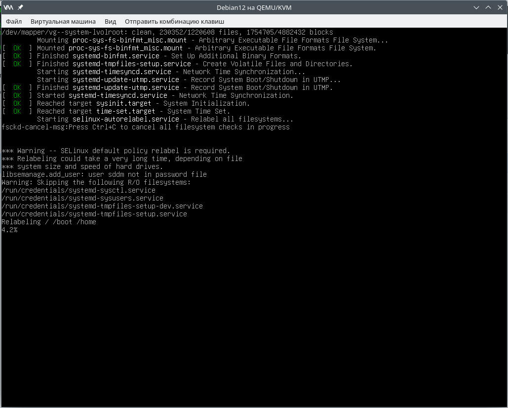

### Selinux. Установка, настройка и примеры использования в Debian Linux Bookworm
_Security-Enhanced Linux (SELinux)_ — это функция _Linux_, которая обеспечивает различные политики безопасности, включая _Mandatory Access Control (MAC)_ в стиле Министерства обороны США, посредством использования модулей безопасности _Linux (LSM)_ в ядре _Linux_. Это не дистрибутив _Linux_, а скорее набор модификаций, которые можно применять к Unix-подобным операционным системам, таким как _Linux_ и _BSD_.

Для запуска _SELinux_ в дистрибутиве _Linux_ требуются три вещи: ядро ​​с поддержкой _SELinux_, инструменты и библиотеки пользовательского пространства _SELinux_, а также политики _SELinux_ (в основном основанные на политике Reference Policy). Некоторые распространенные программы _Linux_ также необходимо будет пропатчить/скомпилировать с функциями _SELinux_. 

[Источник](https://wiki.archlinux.org/title/SELinux)

Цель работы:
  - объяснить, что такое системы принудительного контроля доступа;
  - объяснить, как работает система _SELinux_;
  - работать с системой _SELinux_.

#### Подготовка окружения
В нашем примере используется гипервизор _Qemu-KVM_, библиотека _Libvirt_. В качестве хостовой системы - _OpenSuse Leap 15.5_. Автоматическое разворачивание стенда осуществляется с помощью _Vagrant_.

Для работы Vagrant с _Libvirt_ установлен пакет _vagrant-libvirt_:
```
Сведения — пакет vagrant-libvirt:
---------------------------------
Репозиторий            : Основной репозиторий
Имя                    : vagrant-libvirt
Версия                 : 0.10.2-bp155.1.19
Архитектура            : x86_64
Поставщик              : openSUSE
Размер после установки : 658,3 KiB
Установлено            : Да
Состояние              : актуален
Пакет с исходным кодом : vagrant-libvirt-0.10.2-bp155.1.19.src
Адрес источника        : https://github.com/vagrant-libvirt/vagrant-libvirt
Заключение             : Провайдер Vagrant для libvirt
Описание               : 

    This is a Vagrant plugin that adds a Libvirt provider to Vagrant, allowing
    Vagrant to control and provision machines via the Libvirt toolkit.
```
Пакет _Vagrant_ также устанавливаем из репозиториев. Текущая версия для _OpenSuse Leap 15.5_:
```
max@localhost:~/vagrant/vg3> vagrant -v
Vagrant 2.2.18
```
Образ операционной системы создан заранее, для этого установлен [Debian Linux из официального образа netinst](https://www.debian.org/distrib/netinst)

#### Установка
Установим пакеты _selinux-basics selinux-policy-default auditd_: 
```
root@debian12:~# apt install selinux-basics selinux-policy-default auditd
```
Запустим _selinux-activate_ для настройки **GRUB** и **PAM** и создания /.autorelabel:
```
root@debian12:~# selinux-activate
Activating SE Linux
Generating grub configuration file ...
Found background image: /usr/share/images/desktop-base/desktop-grub.png
Found linux image: /boot/vmlinuz-6.1.0-22-amd64
Found initrd image: /boot/initrd.img-6.1.0-22-amd64
Found linux image: /boot/vmlinuz-6.1.0-21-amd64
Found initrd image: /boot/initrd.img-6.1.0-21-amd64
Warning: os-prober will not be executed to detect other bootable partitions.
Systems on them will not be added to the GRUB boot configuration.
Check GRUB_DISABLE_OS_PROBER documentation entry.
done
SE Linux is activated.  You may need to reboot now.
```
Проверим, что файл создался: 
```
root@debian12:~# ls -l /.autorelabel 
-rw-r--r-- 1 root root 0 сен  4 09:24 /.autorelabel
```
После перезагрузки системе потребуется некоторое время, чтобы промаркировать файловые системы:


А затем, когда процесс завершится, компьютер автоматически перезагрузится во второй раз. Когда компьютер загрузится, проверим, успешно ли всё прошло:
```
root@debian12:~# check-selinux-installation
```
Также убедимся, что у нас установлен пакет _setools_: 
```
root@debian12:~# apt show setools
Package: setools
Version: 4.4.1-2
Priority: optional
Section: admin
Maintainer: Debian SELinux maintainers <selinux-devel@lists.alioth.debian.org>
Installed-Size: 175 kB
Depends: python3-setools (= 4.4.1-2), python3:any
Suggests: setools-gui
Homepage: https://github.com/SELinuxProject/setools/wiki
Tag: admin::kernel, admin::user-management, devel::lang:c, devel::library,
 implemented-in::c, interface::graphical, interface::x11,
 role::devel-lib, role::program, security::TODO, uitoolkit::gtk,
 use::configuring, x11::application
Download-Size: 43,7 kB
APT-Manual-Installed: no
APT-Sources: http://deb.debian.org/debian bookworm/main amd64 Packages
Description: tools for Security Enhanced Linux policy analysis
 Security-enhanced Linux is a patch of the Linux kernel and a number
 of utilities with enhanced security functionality designed to add
 mandatory access controls to Linux. These are Tools for analysing
 security policy on SELinux systems.
 .
 This package contains the following CLI tools:
 .
  * sechecker: automated SELinux policy analysis tool
  * sediff: SELinux policy difference tool
  * sedta: domain transition analysis for SELinux policies
  * seinfo: SELinux policy information tool
  * seinfoflow: information flow analysis for SELinux policies
  * sesearch: SELinux policy query tool
```
#### Настройка
Основные утилиты, необходимые для работы с _SELinux_:

 - _sestatus_ - утилита для просмотра состояния SELinux;
 - _audit2why_ - преобразовывает сообщения аудита SELinux в описание причины отказа в доступе (audit2allow -w);
 - _audit2allow_ - создаёт правила политики SELinux allow/dontaudit из журналов отклонённых операций;
 - _semanage_ - средство управления политикой SELinux;
 - _semanage-port_ - средство сопоставления портов для управления политикой SELinux;
 - _semanage-boolean_ - утилита для управления политикой SELinux, основанная на использовании логических переключателей.
 - _setenforce_ - изменить режим, в котором выполняется SELinux.

Проверим статус _SELinux_: 
```
root@debian12:~# sestatus 
SELinux status:                 enabled
SELinuxfs mount:                /sys/fs/selinux
SELinux root directory:         /etc/selinux
Loaded policy name:             default
Current mode:                   permissive
Mode from config file:          permissive
Policy MLS status:              enabled
Policy deny_unknown status:     allowed
Memory protection checking:     actual (secure)
Max kernel policy version:      33
```
> [!NOTE]
> Здесь мы видим, что в настоящее время Selinux работает в режиме _Permissive_, т.е. ограничения не работают, но в журнал заносятся записи о всех ошибках, связанных с разрешениями. 
Временно изменим режим работы:
```
root@debian12:~# setenforce 1
root@debian12:~# sestatus 
SELinux status:                 enabled
SELinuxfs mount:                /sys/fs/selinux
SELinux root directory:         /etc/selinux
Loaded policy name:             default
Current mode:                   enforcing
Mode from config file:          permissive
Policy MLS status:              enabled
Policy deny_unknown status:     allowed
Memory protection checking:     actual (secure)
Max kernel policy version:      33
```
Чтобы установить постоянный режим работы на _Enforcing_, потребуется отредактировать файл _/etc/selinux/config_: 
```
# This file controls the state of SELinux on the system.
# SELINUX= can take one of these three values:
# enforcing - SELinux security policy is enforced.
# permissive - SELinux prints warnings instead of enforcing.
# disabled - No SELinux policy is loaded.
SELINUX=permissive
# SELINUXTYPE= can take one of these two values:
# default - equivalent to the old strict and targeted policies
# mls     - Multi-Level Security (for military and educational use)
# src     - Custom policy built from source
SELINUXTYPE=default
 
# SETLOCALDEFS= Check local definition changes
SETLOCALDEFS=0
```
Проверяем _audit.log_ на наличие ошибок: 
```
root@debian12:~# audit2why -al
type=AVC msg=audit(1725360694.664:42): avc:  denied  { search } for  pid=550 comm="accounts-daemon" name=".cache" dev="dm-0" ino=24 scontext=system_u:system_r:accountsd_t:s0 tcontext=system_u:object_r:xdg_cache_t:s0 tclass=dir permissive=1
        Was caused by:
                Missing type enforcement (TE) allow rule.
 
                You can use audit2allow to generate a loadable module to allow this access.
 
type=AVC msg=audit(1725360695.008:58): avc:  denied  { search } for  pid=576 comm="NetworkManager" name=".cache" dev="dm-0" ino=24 scontext=system_u:system_r:NetworkManager_t:s0 tcontext=system_u:object_r:xdg_cache_t:s0 tclass=dir permissive=1
        Was caused by:
                Missing type enforcement (TE) allow rule.
 
                You can use audit2allow to generate a loadable module to allow this access.
 
type=AVC msg=audit(1725360695.268:66): avc:  denied  { module_request } for  pid=601 comm="ModemManager" kmod="net-pf-42" scontext=system_u:system_r:modemmanager_t:s0 tcontext=system_u:system_r:kernel_t:s0 tclass=system permissive=1
        Was caused by:
                Missing type enforcement (TE) allow rule.
 
                You can use audit2allow to generate a loadable module to allow this access.
 
type=AVC msg=audit(1725360695.268:66): avc:  denied  { create } for  pid=601 comm="ModemManager" scontext=system_u:system_r:modemmanager_t:s0 tcontext=system_u:system_r:modemmanager_t:s0 tclass=qipcrtr_socket permissive=1
        Was caused by:
                Missing type enforcement (TE) allow rule.
 
                You can use audit2allow to generate a loadable module to allow this access.
 
type=AVC msg=audit(1725360695.288:67): avc:  denied  { net_admin } for  pid=634 comm="modprobe" capability=12  scontext=system_u:system_r:kmod_t:s0 tcontext=system_u:system_r:kmod_t:s0 tclass=capability permissive=1
        Was caused by:
                Missing type enforcement (TE) allow rule.
 
                You can use audit2allow to generate a loadable module to allow this access.
 
type=AVC msg=audit(1725360695.296:68): avc:  denied  { getopt } for  pid=601 comm="ModemManager" scontext=system_u:system_r:modemmanager_t:s0 tcontext=system_u:system_r:modemmanager_t:s0 tclass=qipcrtr_socket permissive=1
        Was caused by:
                Missing type enforcement (TE) allow rule.
 
                You can use audit2allow to generate a loadable module to allow this access.
 
type=AVC msg=audit(1725360695.296:69): avc:  denied  { getattr } for  pid=601 comm="ModemManager" scontext=system_u:system_r:modemmanager_t:s0 tcontext=system_u:system_r:modemmanager_t:s0 tclass=qipcrtr_socket permissive=1
        Was caused by:
                Missing type enforcement (TE) allow rule.
...
```
Видим, что журнал переполнен сообщениями с ошибками. Вместе с этим в данный журнал пишутся рекомендации по устранению ошибок. В части этих рекомендаций есть предложения по включению необходимых опций. Отфильтруем эти рекомендации по настраиваемым опциям:
```
root@debian12:~# audit2why -al | grep "setsebool -P"
        # setsebool -P allow_execmem 1
        # setsebool -P allow_execstack 1
        # setsebool -P xserver_gnome_xdm 1
        # setsebool -P allow_execmem 1
        # setsebool -P allow_execstack 1
        # setsebool -P xserver_gnome_xdm 1
        # setsebool -P allow_execmem 1
        # setsebool -P allow_execstack 1
        # setsebool -P xserver_gnome_xdm 1
        # setsebool -P allow_execmem 1
        # setsebool -P allow_execstack 1
        # setsebool -P xserver_gnome_xdm 1
        # setsebool -P allow_execmem 1
        # setsebool -P allow_execstack 1
        # setsebool -P xserver_gnome_xdm 1
```
И выполним их:
```
root@debian12:~# eval "$( audit2why -al | grep "setsebool -P" | awk '{print $2,$3,$4,$5}' | sort | uniq )"
```
Очистим журнал и перезагрузим систему:
```
root@debian12:~# echo > /var/log/audit/audit.log
root@debian12:~# reboot
```
После перезагрузки снова проверим журнал: 
```
root@debian12:~# audit2why -al
type=AVC msg=audit(1725364389.878:254): avc:  denied  { signal } for  pid=1484 comm="plymouthd" scontext=system_u:system_r:plymouthd_t:s0 tcontext=system_u:system_r:init_t:s0 tclass=process permissive=1
        Was caused by:
                Missing type enforcement (TE) allow rule.
 
                You can use audit2allow to generate a loadable module to allow this access.
 
type=AVC msg=audit(1725364389.898:255): avc:  denied  { checkpoint_restore } for  pid=1484 comm="plymouthd" capability=40  scontext=system_u:system_r:plymouthd_t:s0 tcontext=system_u:system_r:plymouthd_t:s0 tclass=capability2 permissive=1
        Was caused by:
                Missing type enforcement (TE) allow rule.
 
                You can use audit2allow to generate a loadable module to allow this access.
 
type=AVC msg=audit(1725364389.998:262): avc:  denied  { getattr } for  pid=1491 comm="(udev-worker)" path="/run/console-setup/font-loaded" dev="tmpfs" ino=842 scontext=system_u:system_r:udev_t:s0 tcontext=system_u:object_r:var_run_t:s0 tclass=file permissive=1
        Was caused by:
                Missing type enforcement (TE) allow rule.
 
                You can use audit2allow to generate a loadable module to allow this access.
 
type=AVC msg=audit(1725364390.022:264): avc:  denied  { open } for  pid=1497 comm="(spawn)" path="/proc/sys/fs/nr_open" dev="proc" ino=1575 scontext=system_u:system_r:udev_t:s0 tcontext=system_u:object_r:sysctl_fs_t:s0 tclass=file permissive=1
        Was caused by:
                Missing type enforcement (TE) allow rule.
 
                You can use audit2allow to generate a loadable module to allow this access.
```
Снова видим множество ошибок. Отфильтруем их по исполняемым файлам:
```
root@debian12:~# for i in $(audit2why -al | grep "comm=" | awk '{print $10}' | sort -g | uniq  | sed -e 's/comm=//' | sed -e 's/(//' | sed -e 's/)//'); do echo "$i" ; done
"accounts-daemon"
"colord"
"colord-sane"
"cups-browsed"
"ModemManager"
"modprobe"
"NetworkManager"
"plymouthd"
"run-parts"
"spawn"
"udev-worker"
```
Создадим разрешающий пользовательский модуль для _accounts-daemon_:
```
root@debian12:~# ausearch --raw --comm "accounts-daemon" | audit2allow -M my-accounts-daemon
********************* ВАЖНО ************************
Чтобы сделать этот пакет политики активным, выполните: semodule -i my-accounts-daemon.pp
```
Просмотрим наш модуль и сделаем его активным:
```
root@debian12:~# cat my-accounts-daemon.te 
 
module my-accounts-daemon 1.0;
 
require {
        type xdg_cache_t;
        type accountsd_t;
        class dir search;
}
 
#============= accountsd_t ==============
allow accountsd_t xdg_cache_t:dir search;
 
root@debian12:~# semodule -i my-accounts-daemon.pp
libsemanage.add_user: user sddm not in password file
```
Посмотрим, какие разрешения нужны процессу _udev-worker_:
```
root@debian12:~# audit2why -al | grep "udev-worker"
type=AVC msg=audit(1725523640.957:197): avc:  denied  { getattr } for  pid=1406 comm="(udev-worker)" path="/run/console-setup/font-loaded" dev="tmpfs" ino=874 scontext=system_u:system_r:udev_t:s0 tcontext=system_u:object_r:var_run_t:s0 tclass=file permissive=1
```
Можно так:
```
root@debian12:~# ausearch --comm "udev-worker"
----
time->Thu Sep  5 10:42:21 2024
type=PROCTITLE msg=audit(1725522141.293:221): proctitle="(udev-worker)"
type=SYSCALL msg=audit(1725522141.293:221): arch=c000003e syscall=262 success=yes exit=0 a0=ffffff9c a1=7ffc9df57370 a2=7ffc9df572e0 a3=0 items=0 ppid=267 pid=1366 auid=4294967295 uid=0 gid=0 euid=0 suid=0 fsuid=0 egid=0 sgid=0 fsgid=0 tty=(none) ses=4294967295 comm="(udev-worker)" exe="/usr/bin/udevadm" subj=system_u:system_r:udev_t:s0 key=(null)
type=AVC msg=audit(1725522141.293:221): avc:  denied  { getattr } for  pid=1366 comm="(udev-worker)" path="/run/console-setup/font-loaded" dev="tmpfs" ino=870 scontext=system_u:system_r:udev_t:s0 tcontext=system_u:object_r:var_run_t:s0 tclass=file permissive=1
----
time->Thu Sep  5 11:07:20 2024
type=PROCTITLE msg=audit(1725523640.957:197): proctitle="(udev-worker)"
type=SYSCALL msg=audit(1725523640.957:197): arch=c000003e syscall=262 success=yes exit=0 a0=ffffff9c a1=7fffc09bdd20 a2=7fffc09bdc90 a3=0 items=0 ppid=269 pid=1406 auid=4294967295 uid=0 gid=0 euid=0 suid=0 fsuid=0 egid=0 sgid=0 fsgid=0 tty=(none) ses=4294967295 comm="(udev-worker)" exe="/usr/bin/udevadm" subj=system_u:system_r:udev_t:s0 key=(null)
type=AVC msg=audit(1725523640.957:197): avc:  denied  { getattr } for  pid=1406 comm="(udev-worker)" path="/run/console-setup/font-loaded" dev="tmpfs" ino=874 scontext=system_u:system_r:udev_t:s0 tcontext=system_u:object_r:var_run_t:s0 tclass=file permissive=1
```

Мы видим, что по пути:
```
path="/run/console-setup/font-loaded" 
```
Контекст _SELinux_ процесса _system\_u:system\_r:udev\_t:s0_ попытался выполнить действие _getattr_ над контекстом _SELinux_ объекта(цели) _system\_u:object\_r:var\_run\_t:s0_.

В данном случае это контекст _SELinux_ _systemd-udevd_, который запущен в домене _udev\_t_:
```
root@debian12:~# ps -elfZ | grep udev
system_u:system_r:udev_t:s0     4 S root         266       1  0  80   0 - 11980 do_epo 11:07 ?        00:00:00 /lib/systemd/systemd-udevd
```
Создадим модули для _udev-worker_, _colord_, _colord-sane_: 
```
root@debian12:~# ausearch --raw --comm "udev-worker" | audit2allow -M my-udev-worker
root@debian12:~# ausearch --raw --comm "colord" | audit2allow -M my-colord
root@debian12:~# ausearch --raw --comm "colord-sane" | audit2allow -M my-colord-sane
```
Сделаем их активными: 
```
root@debian12:~# semodule -i my-colord.pp my-colord-sane.pp my-udev-worker.pp
```
Проверим, появились ли они среди остальных модулей: 
```
root@debian12:~# semodule -l | grep "my-"
my-accounts-daemon
my-colord
my-colord-sane
my-udev-worker
```
Создадим модули для остальных исполняемых файлов: 
```
root@debian12:~# for i in $(audit2why -al | grep "comm=" | awk '{print $10}' | sort -g | uniq  | sed -e 's/comm=//' | sed -e 's/(//' | sed -e 's/)//'); do echo "$i" ; done
"cups-browsed"
"ModemManager"
"modprobe"
"NetworkManager"
"plymouthd"
"run-parts"
"spawn"
root@debian12:~# ausearch --raw --comm "cups-browsed" | audit2allow -M my-cups-browsed
********************* ВАЖНО ************************
Чтобы сделать этот пакет политики активным, выполните: semodule -i my-cups-browsed.pp
 
root@debian12:~# ausearch --raw --comm "ModemManager" | audit2allow -M my-ModemManager
********************* ВАЖНО ************************
Чтобы сделать этот пакет политики активным, выполните: semodule -i my-ModemManager.pp
 
root@debian12:~# ausearch --raw --comm "modprobe" | audit2allow -M my-modprobe
********************* ВАЖНО ************************
Чтобы сделать этот пакет политики активным, выполните: semodule -i my-modprobe.pp
 
root@debian12:~# ausearch --raw --comm "NetworkManager" | audit2allow -M my-NetworkManager
********************* ВАЖНО ************************
Чтобы сделать этот пакет политики активным, выполните: semodule -i my-NetworkManager.pp
 
root@debian12:~# ausearch --raw --comm "plymouthd" | audit2allow -M my-plymouthd
********************* ВАЖНО ************************
Чтобы сделать этот пакет политики активным, выполните: semodule -i my-plymouthd.pp
 
root@debian12:~# ausearch --raw --comm "run-parts" | audit2allow -M my-run-parts
********************* ВАЖНО ************************
Чтобы сделать этот пакет политики активным, выполните: semodule -i my-run-parts.pp
 
root@debian12:~# ausearch --raw --comm "run-spawn" | audit2allow -M my-spawn
Nothing to do
root@debian12:~# ausearch --raw --comm "spawn" | audit2allow -M my-spawn
********************* ВАЖНО ************************
Чтобы сделать этот пакет политики активным, выполните: semodule -i my-spawn.pp
```
Делаем их активными, очищаем журнал, перезагружаемся: 
```
root@debian12:~# semodule -i my-cups-browsed.pp my-ModemManager.pp my-modprobe.pp my-NetworkManager.pp my-plymouthd.pp my-run-parts.pp my-spawn.pp
libsemanage.add_user: user sddm not in password file
root@debian12:~# ls -l | grep my- | grep "\.pp" | wc -l
11
root@debian12:~# semodule -l | grep "my-" | wc -l
11
root@debian12:~# ls -l | grep my- | grep "\.pp"
-rw-r--r--. 1 root root  952 сен  5 11:05 my-accounts-daemon.pp
-rw-r--r--. 1 root root 1732 сен  5 14:05 my-colord.pp
-rw-r--r--. 1 root root  971 сен  5 13:37 my-colord-sane.pp
-rw-r--r--. 1 root root  869 сен  5 15:58 my-cups-browsed.pp
-rw-r--r--. 1 root root 1211 сен  5 15:58 my-ModemManager.pp
-rw-r--r--. 1 root root  870 сен  5 15:58 my-modprobe.pp
-rw-r--r--. 1 root root 1123 сен  5 15:59 my-NetworkManager.pp
-rw-r--r--. 1 root root 1296 сен  5 15:59 my-plymouthd.pp
-rw-r--r--. 1 root root  947 сен  5 15:59 my-run-parts.pp
-rw-r--r--. 1 root root 1156 сен  5 16:00 my-spawn.pp
-rw-r--r--. 1 root root  937 сен  5 13:05 my-udev-worker.pp
root@debian12:~# semodule -l | grep "my-"
my-ModemManager
my-NetworkManager
my-accounts-daemon
my-colord
my-colord-sane
my-cups-browsed
my-modprobe
my-plymouthd
my-run-parts
my-spawn
my-udev-worker
root@debian12:~# echo > /var/log/audit/audit.log 
root@debian12:~# reboot
```
Проверим наличие ошибок в журнале: 
```
root@debian12:~# audit2why -al | grep denied
type=AVC msg=audit(1725542524.684:57): avc:  denied  { execute_no_trans } for  pid=659 comm="run-parts" path="/etc/wpa_supplicant/ifupdown.sh" dev="dm-0" ino=949861 scontext=system_u:system_r:NetworkManager_t:s0 tcontext=system_u:object_r:etc_t:s0 tclass=file permissive=1
type=AVC msg=audit(1725542524.868:63): avc:  denied  { execute_no_trans } for  pid=679 comm="run-parts" path="/etc/wpa_supplicant/ifupdown.sh" dev="dm-0" ino=949861 scontext=system_u:system_r:NetworkManager_t:s0 tcontext=system_u:object_r:etc_t:s0 tclass=file permissive=1
type=USER_AVC msg=audit(1725542527.844:77): pid=554 uid=101 auid=4294967295 ses=4294967295 subj=system_u:system_r:system_dbusd_t:s0 msg='avc:  denied  { send_msg } for msgtype=method_return dest=:1.33 spid=556 tpid=764 scontext=system_u:system_r:initrc_t:s0 tcontext=unconfined_u:unconfined_r:unconfined_t:s0-s0:c0.c1023 tclass=dbus permissive=1  exe="/usr/bin/dbus-daemon" sauid=101 hostname=? addr=? terminal=?'
type=USER_AVC msg=audit(1725542528.996:83): pid=554 uid=101 auid=4294967295 ses=4294967295 subj=system_u:system_r:system_dbusd_t:s0 msg='avc:  denied  { send_msg } for msgtype=method_return dest=:1.37 spid=597 tpid=849 scontext=system_u:system_r:modemmanager_t:s0 tcontext=system_u:system_r:initrc_t:s0 tclass=dbus permissive=1  exe="/usr/bin/dbus-daemon" sauid=101 hostname=? addr=? terminal=?'
type=USER_AVC msg=audit(1725542529.392:86): pid=554 uid=101 auid=4294967295 ses=4294967295 subj=system_u:system_r:system_dbusd_t:s0 msg='avc:  denied  { send_msg } for msgtype=method_return dest=:1.43 spid=597 tpid=884 scontext=system_u:system_r:modemmanager_t:s0 tcontext=system_u:system_r:xdm_t:s0 tclass=dbus permissive=1  exe="/usr/bin/dbus-daemon" sauid=101 hostname=? addr=? terminal=?'
type=USER_AVC msg=audit(1725542529.464:87): pid=554 uid=101 auid=4294967295 ses=4294967295 subj=system_u:system_r:system_dbusd_t:s0 msg='avc:  denied  { send_msg } for msgtype=method_return dest=:1.44 spid=552 tpid=883 scontext=system_u:system_r:avahi_t:s0 tcontext=system_u:system_r:xdm_t:s0 tclass=dbus permissive=1  exe="/usr/bin/dbus-daemon" sauid=101 hostname=? addr=? terminal=?'
type=USER_AVC msg=audit(1725542529.628:88): pid=554 uid=101 auid=4294967295 ses=4294967295 subj=system_u:system_r:system_dbusd_t:s0 msg='avc:  denied  { send_msg } for msgtype=method_call interface=org.freedesktop.DBus.Peer member=Ping dest=org.freedesktop.Avahi spid=901 tpid=552 scontext=system_u:system_r:colord_t:s0 tcontext=system_u:system_r:avahi_t:s0 tclass=dbus permissive=1  exe="/usr/bin/dbus-daemon" sauid=101 hostname=? addr=? terminal=?'
type=USER_AVC msg=audit(1725542529.628:89): pid=554 uid=101 auid=4294967295 ses=4294967295 subj=system_u:system_r:system_dbusd_t:s0 msg='avc:  denied  { send_msg } for msgtype=method_return dest=:1.45 spid=552 tpid=901 scontext=system_u:system_r:avahi_t:s0 tcontext=system_u:system_r:colord_t:s0 tclass=dbus permissive=1  exe="/usr/bin/dbus-daemon" sauid=101 hostname=? addr=? terminal=?'
type=USER_AVC msg=audit(1725542531.332:95): pid=1 uid=0 auid=4294967295 ses=4294967295 subj=system_u:system_r:init_t:s0 msg='avc:  denied  { status } for auid=n/a uid=113 gid=121 cmdline="/usr/libexec/gsd-power" function="mac_selinux_filter" scontext=system_u:system_r:xdm_t:s0 tcontext=system_u:system_r:init_t:s0 tclass=system permissive=1  exe="/usr/lib/systemd/systemd" sauid=0 hostname=? addr=? terminal=?'
```
Найдем записи для **pid=554**, а так же узнаем, что это за служба и создадим модуль для данного процесса: 
```
root@debian12:~# ausearch --pid 554
----
time->Thu Sep  5 16:22:07 2024
type=USER_AVC msg=audit(1725542527.844:77): pid=554 uid=101 auid=4294967295 ses=4294967295 subj=system_u:system_r:system_dbusd_t:s0 msg='avc:  denied  { send_msg } for msgtype=method_return dest=:1.33 spid=556 tpid=764 scontext=system_u:system_r:initrc_t:s0 tcontext=unconfined_u:unconfined_r:unconfined_t:s0-s0:c0.c1023 tclass=dbus permissive=1  exe="/usr/bin/dbus-daemon" sauid=101 hostname=? addr=? terminal=?'
----
time->Thu Sep  5 16:22:08 2024
type=USER_AVC msg=audit(1725542528.996:83): pid=554 uid=101 auid=4294967295 ses=4294967295 subj=system_u:system_r:system_dbusd_t:s0 msg='avc:  denied  { send_msg } for msgtype=method_return dest=:1.37 spid=597 tpid=849 scontext=system_u:system_r:modemmanager_t:s0 tcontext=system_u:system_r:initrc_t:s0 tclass=dbus permissive=1  exe="/usr/bin/dbus-daemon" sauid=101 hostname=? addr=? terminal=?'
----
time->Thu Sep  5 16:22:09 2024
type=USER_AVC msg=audit(1725542529.392:86): pid=554 uid=101 auid=4294967295 ses=4294967295 subj=system_u:system_r:system_dbusd_t:s0 msg='avc:  denied  { send_msg } for msgtype=method_return dest=:1.43 spid=597 tpid=884 scontext=system_u:system_r:modemmanager_t:s0 tcontext=system_u:system_r:xdm_t:s0 tclass=dbus permissive=1  exe="/usr/bin/dbus-daemon" sauid=101 hostname=? addr=? terminal=?'
----
time->Thu Sep  5 16:22:09 2024
type=USER_AVC msg=audit(1725542529.464:87): pid=554 uid=101 auid=4294967295 ses=4294967295 subj=system_u:system_r:system_dbusd_t:s0 msg='avc:  denied  { send_msg } for msgtype=method_return dest=:1.44 spid=552 tpid=883 scontext=system_u:system_r:avahi_t:s0 tcontext=system_u:system_r:xdm_t:s0 tclass=dbus permissive=1  exe="/usr/bin/dbus-daemon" sauid=101 hostname=? addr=? terminal=?'
----
time->Thu Sep  5 16:22:09 2024
type=USER_AVC msg=audit(1725542529.628:88): pid=554 uid=101 auid=4294967295 ses=4294967295 subj=system_u:system_r:system_dbusd_t:s0 msg='avc:  denied  { send_msg } for msgtype=method_call interface=org.freedesktop.DBus.Peer member=Ping dest=org.freedesktop.Avahi spid=901 tpid=552 scontext=system_u:system_r:colord_t:s0 tcontext=system_u:system_r:avahi_t:s0 tclass=dbus permissive=1  exe="/usr/bin/dbus-daemon" sauid=101 hostname=? addr=? terminal=?'
----
time->Thu Sep  5 16:22:09 2024
type=USER_AVC msg=audit(1725542529.628:89): pid=554 uid=101 auid=4294967295 ses=4294967295 subj=system_u:system_r:system_dbusd_t:s0 msg='avc:  denied  { send_msg } for msgtype=method_return dest=:1.45 spid=552 tpid=901 scontext=system_u:system_r:avahi_t:s0 tcontext=system_u:system_r:colord_t:s0 tclass=dbus permissive=1  exe="/usr/bin/dbus-daemon" sauid=101 hostname=? addr=? terminal=?'
root@debian12:~# ps -elfZ | grep 554
system_u:system_r:system_dbusd_t:s0 4 S message+ 554       1  0  80   0 -  2682 do_epo 16:22 ?        00:00:00 /usr/bin/dbus-daemon --system --address=systemd: --nofork --nopidfile --systemd-activation --syslog-only
unconfined_u:unconfined_r:unconfined_t:s0-s0:c0.c1023 0 S root 1372 1247  0 80 0 - 1589 pipe_r 16:57 pts/1 00:00:00 grep 554
root@debian12:~# ausearch --raw --pid 554 | audit2allow -M my-dbus-daemon
********************* ВАЖНО ************************
Чтобы сделать этот пакет политики активным, выполните: semodule -i my-dbus-daemon.pp
```
 
Проверим, что у нас получилось и сделаем модуль активным:
```
root@debian12:~# cat my-dbus-daemon.te 
 
module my-dbus-daemon 1.0;
 
require {
        type xdm_t;
        type initrc_t;
        type colord_t;
        type avahi_t;
        type modemmanager_t;
        type unconfined_t;
        class dbus send_msg;
}
 
#============= avahi_t ==============
allow avahi_t colord_t:dbus send_msg;
allow avahi_t xdm_t:dbus send_msg;
 
#============= colord_t ==============
allow colord_t avahi_t:dbus send_msg;
 
#============= initrc_t ==============
allow initrc_t unconfined_t:dbus send_msg;
 
#============= modemmanager_t ==============
allow modemmanager_t initrc_t:dbus send_msg;
allow modemmanager_t xdm_t:dbus send_msg;
root@debian12:~# semodule -i my-dbus-daemon.pp
libsemanage.add_user: user sddm not in password file
root@debian12:~# semodule -l | grep my-
my-ModemManager
my-NetworkManager
my-accounts-daemon
my-colord
my-colord-sane
my-cups-browsed
my-dbus-daemon
my-modprobe
my-plymouthd
my-run-parts
my-spawn
my-udev-worker
```
Снова чистим журнал и перезагружаемся: 
```
root@debian12:~# echo > /var/log/audit/audit.log 
root@debian12:~# reboot
```
Теперь создадим общий пользовательский модуль для всех записей в журнале аудита: 
```
root@debian12:~# audit2allow -M my-all --debug < /var/log/audit/audit.log
********************* ВАЖНО ************************
Чтобы сделать этот пакет политики активным, выполните: semodule -i my-all.pp
 
root@debian12:~# cat my-all.te 
 
module my-all 1.0;
 
require {
        type xdm_t;
        type init_t;
        type etc_t;
        type NetworkManager_t;
        class file execute_no_trans;
        class system status;
}
 
#============= NetworkManager_t ==============
allow NetworkManager_t etc_t:file execute_no_trans;
 
#============= xdm_t ==============
allow xdm_t init_t:system status;
```
Делаем этот пакет политики активным и перезагружаемся: 
```
root@debian12:~# semodule -i my-all.pp
libsemanage.add_user: user sddm not in password file
```
Проверяем, что все ошибки ушли: 
```
max@localhost:~/vagrant/vg3> vagrant ssh
Linux debian12 6.1.0-22-amd64 #1 SMP PREEMPT_DYNAMIC Debian 6.1.94-1 (2024-06-21) x86_64
 
The programs included with the Debian GNU/Linux system are free software;
the exact distribution terms for each program are described in the
individual files in /usr/share/doc/*/copyright.
 
Debian GNU/Linux comes with ABSOLUTELY NO WARRANTY, to the extent
permitted by applicable law.
Last login: Fri Sep  6 09:35:40 2024 from 192.168.121.1
vagrant@debian12:~$ sudo -i
root@debian12:~# audit2why -al
```
#### Разрешение для веб-сервера работать на нестандартном порту
Проверим, какие порты разрешены для типа порта _SELinux_ - _http\_port\_t_: 
```
root@debian12:~# semanage port -l | grep "^http_port_t"
http_port_t                    tcp      80, 443, 488, 8008, 8009, 8443, 8448
```
Попробуем запустить _nginx_ на порту, который не входит в полученный список. Для этого изменим параметр _listen_:
```
# Default server configuration
#
server {
        listen 8085 default_server;
        listen [::]:8085 default_server;
```
Пробуем перезапустить _nginx_, перед этим проверим журнал аудита:
```
root@debian12:~# audit2why -al
root@debian12:~#
root@debian12:~# systemctl restart nginx.service 
root@debian12:~# ss -ntlp
State                  Recv-Q                 Send-Q                                  Local Address:Port                                   Peer Address:Port                 Process                                                                                          
LISTEN                 0                      511                                           0.0.0.0:8085                                        0.0.0.0:*                     users:(("nginx",pid=1404,fd=5),("nginx",pid=1403,fd=5),("nginx",pid=1402,fd=5))                 
LISTEN                 0                      128                                         127.0.0.1:631                                         0.0.0.0:*                     users:(("cupsd",pid=619,fd=7))                                                                  
LISTEN                 0                      128                                           0.0.0.0:22                                          0.0.0.0:*                     users:(("sshd",pid=633,fd=3))                                                                   
LISTEN                 0                      511                                              [::]:8085                                           [::]:*                     users:(("nginx",pid=1404,fd=6),("nginx",pid=1403,fd=6),("nginx",pid=1402,fd=6))                 
LISTEN                 0                      128                                             [::1]:631                                            [::]:*                     users:(("cupsd",pid=619,fd=6))                                                                  
LISTEN                 0                      128
```
Как видим, веб-сервер успешно работает на новом порту, но в журнале аудита появились новые записи (напомню, _Selinux_ у нас работает в режиме _Permissive_): 
```
root@debian12:~# audit2why -al
type=AVC msg=audit(1725453497.253:137): avc:  denied  { name_bind } for  pid=1398 comm="nginx" src=8085 scontext=system_u:system_r:httpd_t:s0 tcontext=system_u:object_r:unreserved_port_t:s0 tclass=tcp_socket permissive=1
        Was caused by:
                Missing type enforcement (TE) allow rule.
 
                You can use audit2allow to generate a loadable module to allow this access.
```
Здесь нам рекомендуют создать модуль для того, чтобы убрать ошибку. Не всегда, полученные от утилиты _audit2why_, предложения являются оптимальными, поэтому мы сделаем по другому. Воспользуемся утилитой _semanage_:
```
root@debian12:~# semanage port -a -t http_port_t -p tcp 8085
libsemanage.add_user: user sddm not in password file
```
Снова проверим журнал: 
```
root@debian12:~# audit2why -al
root@debian12:~#
```
И список разрешённых портов для _http\_port\_t_: 
```
root@debian12:~# semanage port -l | grep "^http_port_t"
http_port_t                    tcp      8085, 80, 443, 488, 8008, 8009, 8443, 8448
```
Как видим, нужный порт добавился к существующим разрешённым.

Спасибо за прочтение! :potted_plant:
